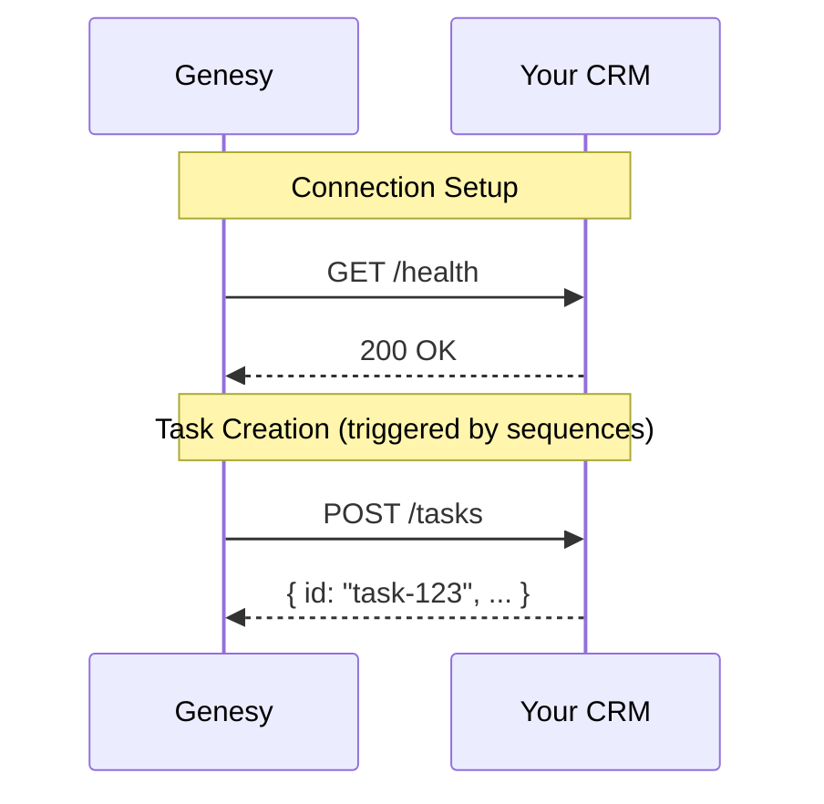

## Overview

The Custom CRM integration allows you to connect Genesy with your own CRM system or internal database. This enables Genesy to create tasks directly in your system when sequences or workflows require task creation.

<Info>
  This integration is designed for companies with proprietary CRM systems or custom-built internal tools that aren't supported by our standard integrations.
</Info>

## How It Works

When you connect a Custom CRM:

1. You provide Genesy with your API base URL and authentication credentials
2. Genesy validates the connection by calling your `/health` endpoint
3. Once connected, Genesy will send task creation requests to your system when needed



## Prerequisites

Before connecting, your CRM must expose the following:

<CardGroup cols={2}>
  <Card title="Health Endpoint" icon="heart-pulse" href="/api-reference/custom-crm/overview#health-endpoint">
    A `GET /health` endpoint for connection validation
  </Card>
  <Card title="Tasks API" icon="list-check" href="/api-reference/custom-crm/tasks">
    Task CRUD and batch endpoints following our interface specification
  </Card>
</CardGroup>

## Authentication

Your CRM must accept API key authentication via a configurable header. When connecting, you'll specify:

| Parameter | Description | Default |
|-----------|-------------|---------|
| `baseUrl` | Your API's base URL (e.g., `https://api.mycrm.com`) | Required |
| `apiKey` | Your API key or secret token | Required |
| `apiKeyHeader` | The header name for authentication | `X-API-Key` |

Genesy will include this header in all requests:

```bash
GET /health HTTP/1.1
Host: api.mycrm.com
X-API-Key: your-secret-key
Content-Type: application/json
Accept: application/json
```

## Connecting Your CRM

### Step 1: Implement the Required Endpoints

Before connecting, ensure your CRM implements the required interface. See the [Custom CRM API Reference](/api-reference/custom-crm/overview) for detailed specifications.

### Step 2: Test the Connection

Use the test endpoint to validate your configuration:

```bash
curl -X POST https://openapi.genesy.ai/v1/custom-crm/test \
  -H "x-api-key: gsk_your_genesy_api_key" \
  -H "Content-Type: application/json" \
  -d '{
    "baseUrl": "https://api.mycrm.com",
    "apiKey": "your-crm-api-key",
    "apiKeyHeader": "X-API-Key"
  }'
```

### Step 3: Connect

Once the test passes, connect your CRM:

```bash
curl -X POST https://openapi.genesy.ai/v1/custom-crm/connect \
  -H "x-api-key: gsk_your_genesy_api_key" \
  -H "Content-Type: application/json" \
  -d '{
    "baseUrl": "https://api.mycrm.com",
    "apiKey": "your-crm-api-key",
    "apiKeyHeader": "X-API-Key"
  }'
```

### Step 4: Verify Status

Check your connection status anytime:

```bash
curl https://openapi.genesy.ai/v1/custom-crm/status \
  -H "x-api-key: gsk_your_genesy_api_key"
```

## Disconnecting

To disconnect your Custom CRM:

```bash
curl -X DELETE https://openapi.genesy.ai/v1/custom-crm/disconnect \
  -H "x-api-key: gsk_your_genesy_api_key"
```

## Next Steps

<CardGroup cols={2}>
  <Card
    title="Tasks API"
    icon="list-check"
    href="/api-reference/custom-crm/tasks"
  >
    View the complete Tasks API specification
  </Card>
  <Card
    title="Examples"
    icon="code"
    href="/api-reference/custom-crm/examples"
  >
    See complete implementation examples in Node.js, Python, and Go
  </Card>
</CardGroup>


